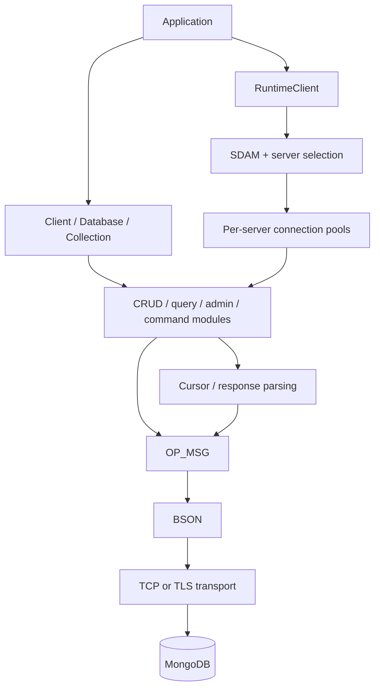
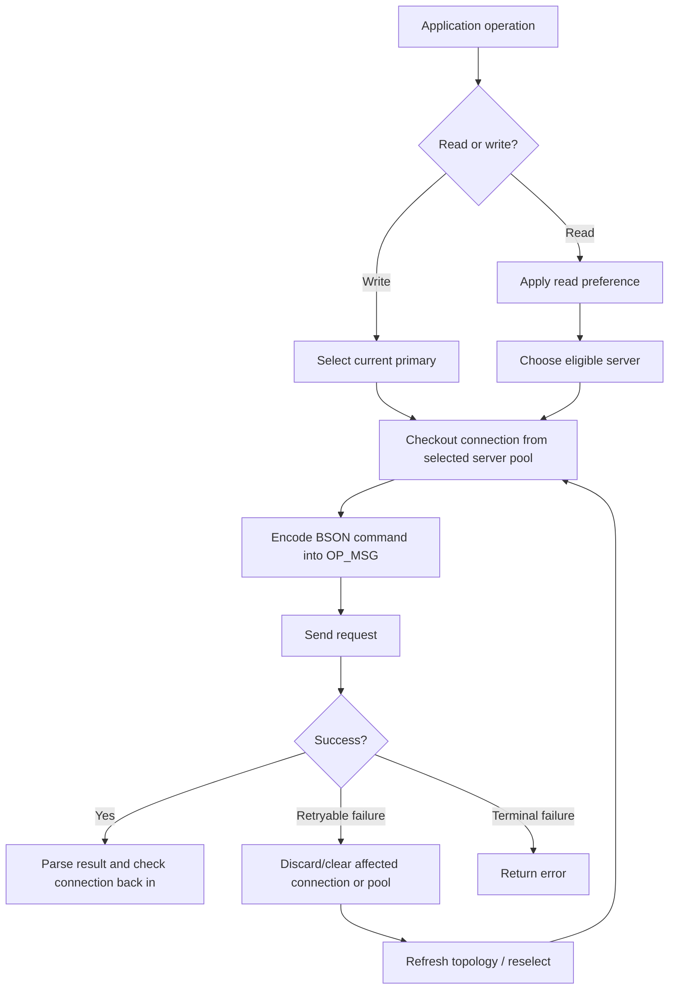
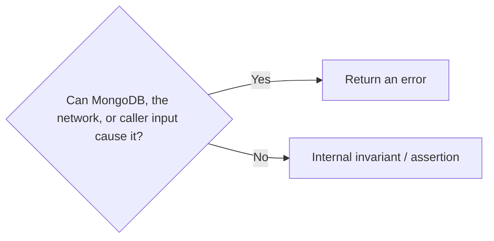

# Architecture

Bongo has two application-facing paths that share the same BSON and MongoDB wire-protocol code:

- `Client` is the simpler single-server API.
- `RuntimeClient` adds URI/SRV configuration, TLS and authentication, connection pools, replica-set discovery, server selection, retries, sessions, and transactions.

Most applications that need a normal MongoDB deployment should start with `RuntimeClient`. The lower-level pieces remain public because they are useful for testing, learning the protocol, and building focused tooling.

## Big picture



The important boundary is that application code does not need to know how an OP_MSG frame is laid out or how a replica-set member was selected. Those details stay below the public client APIs.

## `Client`

`Client` is the direct single-server path. It owns one authenticated connection and exposes `Database` and `Collection` handles for CRUD, queries, commands, indexes, and administration.

A `Database` or `Collection` is a lightweight borrowed handle. Creating one does not open another socket or allocate another client.

Use `Client` when a single known MongoDB server is exactly what you want. Use `RuntimeClient` when the deployment needs URI/SRV handling, pooling, replica-set behavior, or transactions.

## `RuntimeClient`

`RuntimeClient` is the managed path used by applications such as Deez. It owns or coordinates:

- normalized connection options;
- the primary application pool;
- per-server read pools;
- an SDAM topology manager and heartbeat work;
- server selection for reads and writes;
- retryable read/write behavior supported by the current deployment;
- session and transaction state;
- deterministic shutdown and active-handle checks.

A replica-set operation roughly follows this path:



The retry loop is deliberately bounded. v0.6 retries the initial `find` command and supported single-document replica-set writes once. Cursor `getMore` is not retried.

## Command modules

Protocol-specific behavior lives in focused modules rather than one giant client file. Examples include:

- `crud.zig` — insert/update/delete commands and write-result parsing;
- `find_options.zig` — configurable find commands;
- `find_and_modify.zig` — atomic find-and-modify operations;
- `aggregate.zig` and `explain.zig` — aggregation and explain commands;
- `collection_admin.zig`, `index_admin.zig`, and `database_admin.zig` — administration;
- `command_response.zig` — common command-response validation;
- `command_cursor.zig` — cursor parsing, `getMore`, and cleanup;
- `runtime_client.zig` — managed routing, retry, shutdown, and public runtime facade;
- `sdam.zig` / `sdam_monitor.zig` — topology state and monitoring;
- `pool.zig` — reusable connection-pool behavior.

This keeps wire-shape knowledge close to the code that validates that shape.

## OP_MSG and BSON

MongoDB commands are BSON documents carried inside OP_MSG messages. Each application command gets a positive request ID. Replies are checked against the expected `responseTo` value before their contents are trusted.

MongoDB replies are external input. A malformed BSON document, wrong response ID, missing field, wrong BSON type, malformed batch, or failed command status is an error—not an assertion.

Bongo exposes raw BSON documents and values today. A broader typed Zig decoding layer remains future work.

## Document ownership

Cursor iteration returns a BSON slice borrowed from the cursor's current response buffer:

```zig
const document = (try cursor.next()).?;
```

That slice is valid only until the cursor advances, closes, or deinitializes.

Operations such as `findOne()` can return an owned document instead:

```zig
var document = (try collection.findOne(filter)).?;
defer document.deinit();
```

Owned bytes remain valid until `deinit()`.

## Cursors

A cursor keeps only the current MongoDB batch in memory. When a batch is exhausted and the server cursor ID is still nonzero, Bongo sends `getMore`. If the caller stops early, Bongo can send `killCursors` during cleanup.

See [cursors.md](cursors.md) for the full lifecycle.

## Error boundary

The rule is simple:



Errors cover malformed replies, command failures, authentication rejection, invalid caller input, timeouts, selection failures, and transport failures. Assertions are reserved for states that should be impossible after Bongo has already validated its inputs.

## Current deployment boundary

As of v0.6, `RuntimeClient` is production-oriented around standalone servers and replica sets. It includes verified server-authenticated TLS, SCRAM, CMAP-style pooling, replica-set SDAM, read preferences, failover, bounded retry behavior, sessions, and transactions.

Bongo still does **not** claim complete MongoDB-driver parity. Major remaining boundaries include full sharded/mongos support, load-balanced mode, complete public/causal session semantics, full transaction-body retry, client-certificate mTLS/X.509 transport, wire compression, and the broader typed BSON ergonomics work.

The [roadmap](ROADMAP.md) tracks those boundaries explicitly.