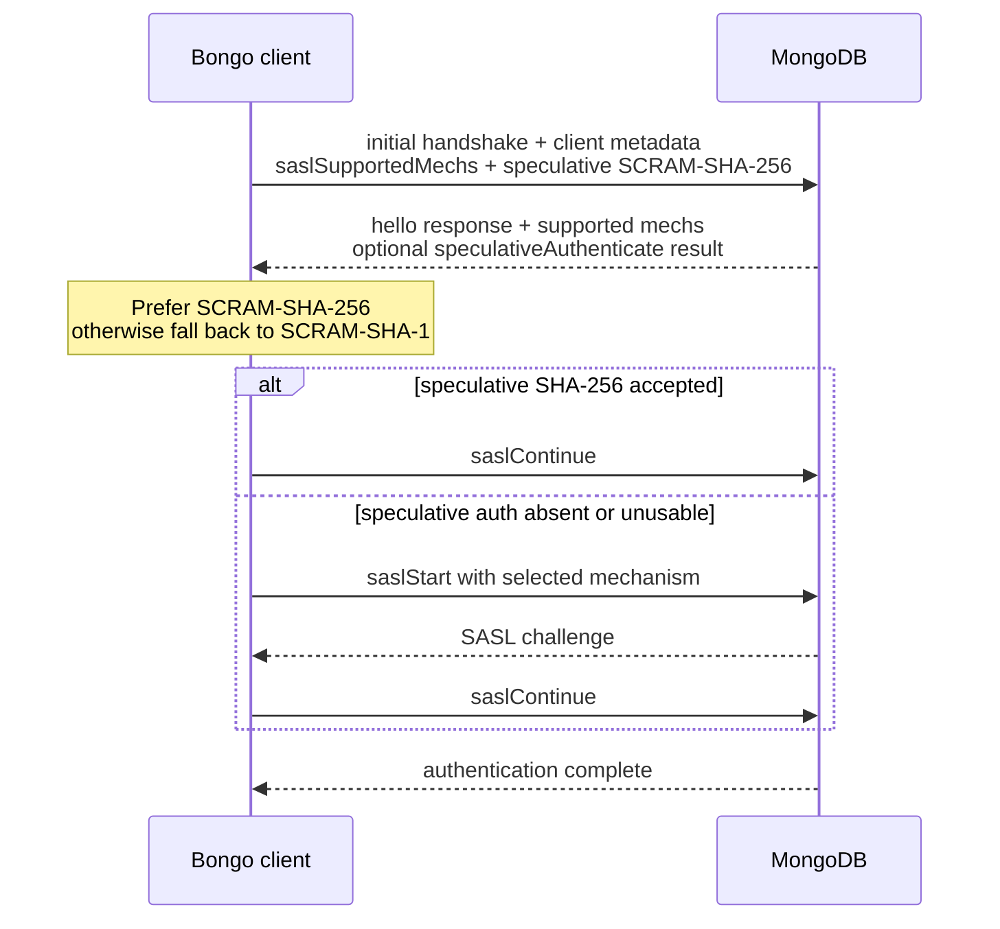

# Authentication handshake

Bongo can negotiate the default SCRAM mechanism during the initial MongoDB handshake and can use speculative authentication to save a round trip on servers that support it.

When TLS is configured, the TLS connection is established and the server certificate/host name are verified before MongoDB authentication begins.

## Handshake flow



`bongo.mongo.authenticateWithHandshake(...)` sends the mechanism lookup using:

- `saslSupportedMechs: "<auth database>.<username>"`; and
- a speculative SCRAM-SHA-256 `saslStart` document when no mechanism is explicitly forced.

The username in `saslSupportedMechs` is the raw username supplied by the application. Bongo does not normalize it before the mechanism lookup.

## Selection rules

When the server returns `saslSupportedMechs`, Bongo prefers `SCRAM-SHA-256` when it is present. If SHA-256 is absent, Bongo falls back to `SCRAM-SHA-1`.

If the field is missing entirely, Bongo also falls back to SHA-1 as required by the MongoDB authentication rules. Unknown mechanism names are ignored rather than treated as handshake failures.

## Speculative authentication

When no explicit mechanism is configured, the speculative command uses SCRAM-SHA-256.

If the handshake response contains `speculativeAuthenticate` and SHA-256 is selected, Bongo treats that embedded response as the first successful SASL exchange and continues directly with `saslContinue`.

If the server ignores speculative authentication, Bongo starts the selected SCRAM mechanism normally after the handshake.

The low-level result records the selected mechanism and whether the speculative exchange was used:

```zig
const result = try bongo.mongo.authenticateWithHandshake(
    &connection,
    allocator,
    "admin",
    "alice",
    "secret",
);

switch (result.selected_mechanism) {
    .scram_sha_256 => {},
    .scram_sha_1 => {},
}
```

## Runtime use

The same handshake/authentication behavior is used when `RuntimeClient` creates managed application connections. New pooled connections are authenticated before they are considered ready for checkout.

Background topology monitoring uses its own hello probes after the initial connection handshake; it does not repeat full authentication negotiation for every heartbeat.

Bongo also sends driver/application metadata during the initial handshake so MongoDB can identify the client and its Zig runtime version.