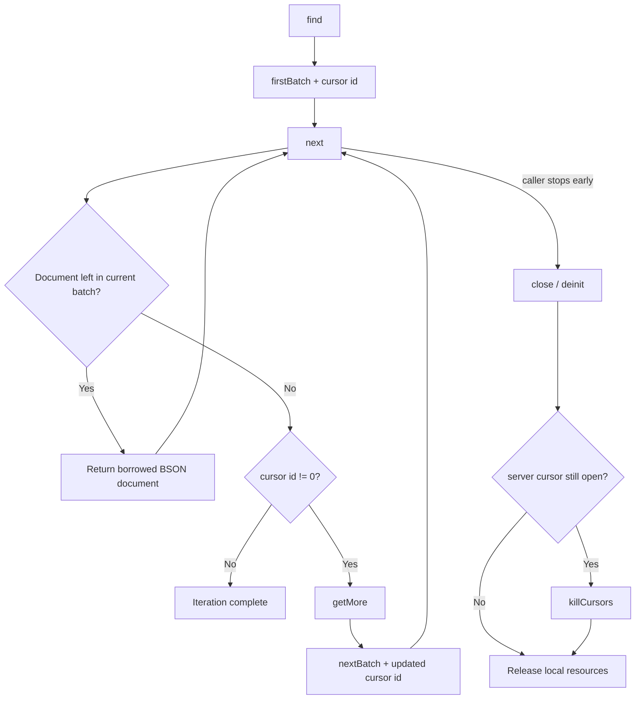
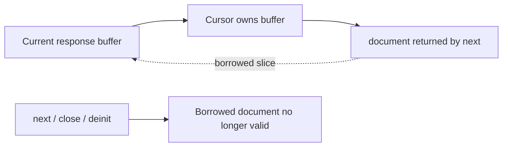

# MongoDB cursors

MongoDB does not necessarily return every matching document in the first response to `find`. The response contains a cursor id and a `firstBatch`. If the id is nonzero, MongoDB still has server-side cursor state for later batches.

## Lifecycle



Applications use the cursor API rather than constructing `getMore` directly:

```zig
var cursor = try collection.find(.{ .active = true });
defer cursor.deinit();

while (try cursor.next()) |document| {
    // document is BSON
}
```

Iteration ends when the current batch is exhausted and MongoDB has returned cursor id `0`.

## Ownership

A cursor owns the state needed to continue iteration:

- the current MongoDB response buffer;
- the current server cursor id;
- the database/collection/namespace information needed for later cursor commands;
- the connection or managed read handle required by that cursor path.

Bongo frees the previous response buffer when it advances to another batch. It does not retain every batch for the life of the query.

A BSON document returned by `next()` borrows from the current response buffer. Treat it as valid only until the next `next()`, `close()`, or `deinit()` call.



The cursor itself must not outlive the client/runtime that created it. `RuntimeClient.deinitChecked()` reports active cursor handles rather than silently tearing down resources underneath them.

## `getMore`

When a batch is exhausted and the server cursor id is nonzero, Bongo sends a command shaped like:

```text
{
    getMore: <cursor id>,
    collection: <collection>,
    $db: <database>
}
```

MongoDB responds with `cursor.nextBatch`. Bongo validates the command result, response id, cursor id, namespace, and batch before exposing documents to the caller.

v0.6 deliberately does **not** retry `getMore`. Retryable-read behavior applies to the initial supported read command, not to later cursor batches whose state may already have advanced on the server.

## Cleanup

Stopping before the server cursor reaches id `0` can leave server-side cursor state alive. `Cursor.close()` sends `killCursors` when cleanup is needed.

`Cursor.deinit()` performs cleanup on a best-effort basis and always releases local resources. Call `close()` explicitly first when the caller needs to observe a `killCursors` error.